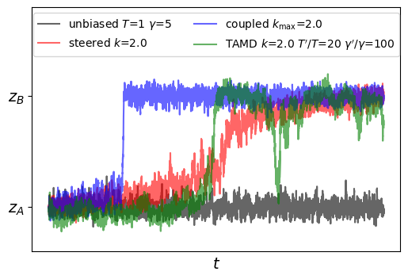

# Biased Brownian Dynamics demonstrations

> Demonstrations of steering, coupling, and TAMD-related biases

The image below was generated using 

`python BDdemos.py -n 2000000 -logevery 1000 -data BDdemoSave.csv`

All parameters shown in the legend are defaults.  Because BD is stochastic, running this program will generate unique results each time.

Brownian dynamics of variable $z$ can be defined as

$$
\dot{z} = \frac{f}{\gamma} + \sqrt{\frac{2k_BT}{\gamma}}\eta
$$

where $\eta$ is a random variable with mean zero and unit variance, $k_B$ is the Boltzmann constant, $T$ is temperature, and $f$ is the force.  We use as the initial condition that $z(0)=z_A$.  The force is the negative gradient of a potential $V$:

$$
f = -\frac{d V}{d z}
$$

Here, we use a background potential that is a two-well quartic

$$
V_{\rm background}(z) = az^4 + bz^2 + cz + d
$$

where $a$ = 0.02 $b$ = -1.0, and $c$ and $d$ are both 0.  This generates a symmetric potential with wells at $z_A$ and $z_B$ and a barrier height of 13.5 energy units at $z=0$.

Bias potentials are of the form

$$
V^{\rm (b)}(z)=-\frac{k}{2}\left(z-z^*\right)^2
$$

For coupling bias, $k$ varies linearly in time from $k_{\rm min}$ to $k_{\rm max}$ with $z^*=z_{B}$.  For steering bias, $z^*$ varies linearly in time from $z_{A}$ to $z_{B}$.

For TAMD, $z^*$ obeys its own BD with friction $\gamma^\prime=500\gamma$ and $T^\prime=20T$ with a force $k(z-z^*)$.  This makes $z^*$ a slow but hot variable that moves along the same energy surface as $z$.